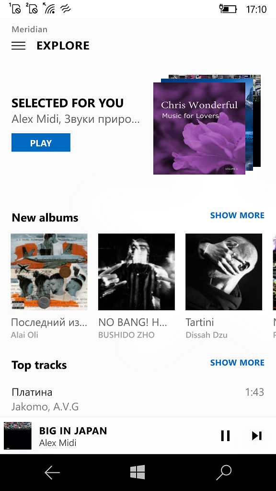

# Meridian 7.3

This is my fork of [Stealth2012's Meridian-UWP, Desktop Edition](https://github.com/artemshuba/meridian-uwp).

So, this is the UWP version for Windows 10/Mobile (min. os. build: 14393).

## About
Meridian is a music player which allows you to listen to music from popular Russian social network [vk.com](https://vk.com). 

It communicates with some additional services like [deezer.com](http://deezer.com) and [last.fm](http://last.fm) 
to bring to you some advanced features: recommendations, artists and albums search and other.

## Screenshots
<table><tr>
<td>  </td>
</tr></table>

## My 2 cents
Absolute Dark Theme now ok (for low-energy deals)
Friend's Music mode - ok
Explore mode - ok 

## The fields to explore
- RemoteKit (RemoteCore + RemoteServer)

## Contributing
Changes and improvements are very welcome. Feel free to fork and open a pull request.

-- [m][e] 2022
