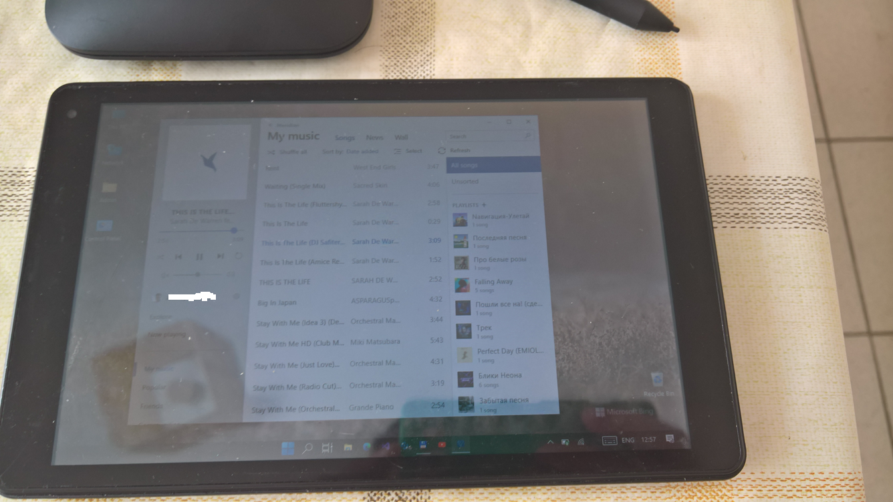
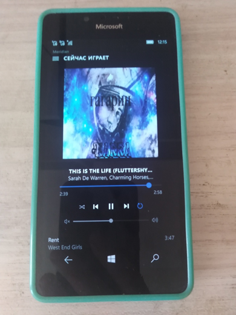

# Meridian v10 

This is my fork of [Stealth2012's Meridian-UWP, Desktop Edition](https://github.com/artemshuba/meridian-uwp).

So, this is the UWP version for Windows 10/Mobile (min. os. build: 10240).

## About
Meridian is a music player which allows you to listen to music from popular Russian social network [vk.com](https://vk.com). 

It communicates with some additional services like [deezer.com](http://deezer.com) and [last.fm](http://last.fm) 
to bring to you some advanced features: recommendations, artists and albums search and other.

## Screenshots
<table><tr>
<td>  </td>
<td>  </td>
</tr></table>

## My 2 cents
- Solution optimization (RemoteKit & LastFm/Deezer/Groove libs truncated/cutted)
- MusicList Exception handling improving (a little)
- Absolute Dark Theme for low-energy deals ok (?)
- Friend's Music mode - ok
- Explore mode - ok (?) 
- Astoria 10240 - successfully compiled but app don t want to start :(

## The fields to explore
- Explore mode (getCatalog emulation via getRecommendetaions)
- Astoria compatibility
- RemoteKit (RemoteCore + RemoteServer)

## TODO
- All code exploring/refactoring
- Additional test for my own "Andromeda" tablet with tweaked Win11Lite x86 :) 
- Return LastFm ... Deezer .. Groove, or something else ? )))

## Contributing
Changes and improvements are very welcome. Feel free to fork and open a pull request! :)

## Credits
- https://github.com/artemshuba Artem Shuba aka Stealth2012, great c# developer

## .. 
As is. No support. RnD only. DIY!

## .
 [m][e] 2024
